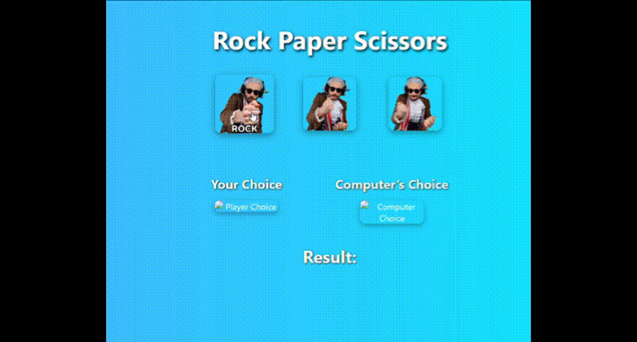

# 🎮 Rock Paper Scissors – Cute GIF Edition

This is a simple, fun, and interactive **Rock Paper Scissors game** built using **HTML**, **CSS**, and **JavaScript**. Instead of plain emojis, it uses **adorable animated GIFs** to make the experience more visually appealing and joyful.

---

## 📸 Demo Preview

> _Gameplay preview with cute GIFs!_



---

## 🚀 Live Demo

You can run this game locally or host it using GitHub Pages or Netlify. A live version will display like this:

---

## ✨ Features

- 🧠 Computer picks randomly each time
- 👆 Interactive buttons with hover animations
- 🖼️ Uses cute animated GIFs instead of emojis
- 💻 Clean, responsive layout with Flexbox
- 🌈 Stylish gradient background
- 📱 Mobile-friendly (tested on phone browser)
- 🥇 Shows result after each round

---

## 💾 How to Use

1. **Clone this repo:**

```bash
git clone https://github.com/your-username/rock-paper-scissors.git
```
2. **Open the folder:**
```bash
cd rock-paper-scissors
```
3. **Run the game:**
  - Open index.html in your browser
      (double-click or use Live Server in VS Code)


🛠️ Tech Stack

    HTML5

    CSS3 (with Flexbox)

    JavaScript (ES6)

🧩 Future Enhancements

    🔢 Add a score counter

    🔊 Add sound effects on click

    🌓 Dark mode toggle

    ⏱️ Timer for each turn

    📱 PWA support (for mobile install)

    🧠 Smarter AI with pattern recognition
  


### ✅ What to Change:
- Replace `your-username` and `your-profile` with your actual GitHub & LinkedIn
- Add a real screenshot or screen recording (optional but makes your repo stand out)
- If you want a `LICENSE` file, I can generate it too

---

Would you like me to:
- ✅ Generate the full GitHub repo ZIP for you?
- ✅ Create a `LICENSE` file for MIT?
- ✅ Show you how to publish this on GitHub Pages?

Let me know — I’ll help you every step of the way!


